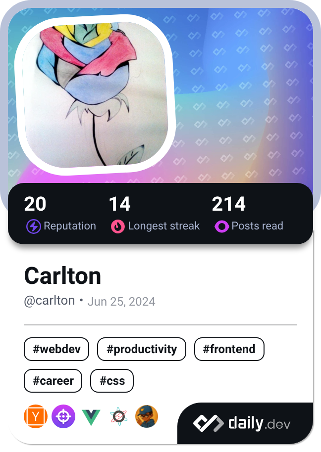

  <ul align="center" style="list-style: none">
    

      <h1>
        👋 Hi, my name is Carlton
      </h1>
    

  </ul>

**<h3 align="left">Connect with me:</h3>** 

 

 <h4 align="left">🚀 I’m all about coding—whether it’s building web apps or crafting games, I love making things.</h4>

 I often code and create things just for fun, and I love sharing some of my projects. You can check them out here: <a href="https://speedzworld.co.za/" target="_blank">speedzworld.co.za</a>.

**<h3 align="left">Rapid Fire</h3>**

- 💼 I'm currently working on: **💻 Building code like it’s my superpower**
- 🌱 I'm currently learning: **📚 Leveling up my reading game—because knowledge is fuel!**
- ⚡ Fun fact: **🎢 I once wrote code using only one hand—while the other was holding a pizza slice!**

 **<h3 align="left">Skills</h3>**

<table style="width: 100%; border: 0px solid white;"><tr><td style="text-align: center; border: 0px; padding: 12px;"></td><td style="text-align: center; border: 0px; padding: 12px;"></td><td style="text-align: center; border: 0px; padding: 12px;"></td><td style="text-align: center; border: 0px; padding: 12px;"></td><td style="text-align: center; border: 0px; padding: 12px;"></td><td style="text-align: center; border: 0px; padding: 12px;"></td></tr><tr><td style="text-align: center; border: 0px; padding: 12px;"></td><td style="text-align: center; border: 0px; padding: 12px;"></td><td style="text-align: center; border: 0px; padding: 12px;"></td><td style="text-align: center; border: 0px; padding: 12px;"></td><td style="text-align: center; border: 0px; padding: 12px;"></td><td style="text-align: center; border: 0px; padding: 12px;"></td></tr><tr><td style="text-align: center; border: 0px; padding: 12px;"></td><td style="text-align: center; border: 0px; padding: 12px;"></td><td style="text-align: center; border: 0px; padding: 12px;"></td></table>

 **<h3 align="left">GitHub Stats</h3>**

  
  

  

 **<h3 align="left">Devcard</h3>**

 
